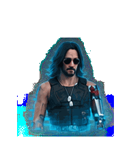

# Johnny Silverhand · 强尼·银手

写实半身 Relic 全息投影风格的 Codex 宠物：墨镜、银色机械臂、蓝青色扫描线与腰部消散效果。

**当前发布内容为 v1**（8 列 × 9 行，57 个有效帧），使用已修复动画裁切的精灵图。v2 的视线动作仍是实验素材，尚未完成。

## 预览

用浏览器打开 [preview.html](preview.html)，可查看 9 种动画、暂停、调速和切换背景。预览和宠物清单使用同一张正式精灵图。



## 安装（macOS）

在仓库根目录执行：

```sh
mkdir -p "$HOME/.codex/pets/johnny-silverhand"
cp johnny-silverhand/pet.json johnny-silverhand/spritesheet.png "$HOME/.codex/pets/johnny-silverhand/"
```

如果已有同名宠物，这会更新配置和精灵图。随后在 Codex 的宠物选择器中刷新并选择“强尼·银手”；必要时重启应用。应用内实际加载仍需自行确认。

编辑 `pet.json` 可以修改显示名和描述。宠物 ID 保持 `johnny-silverhand`。

## 目录

| 路径 | 用途 |
| --- | --- |
| `johnny-silverhand/` | 可安装的正式包，仅包含清单和精灵图 |
| `preview.html` | 无需依赖的动画预览 |
| `assets/source/` | 原始生成图，按 `chibi`、`relic-bust` 命名 |
| `docs/prompts/` | 对应风格的生成提示词 |
| `archive/chibi/` | 早期 Q 版全身精灵图 |
| `archive/relic-original/` | 裁切修复前的 Relic 图和清单 |
| `archive/v2-workbench/` | 未完成的 v2 探索、逐帧素材、历史 QA 和提示词 |

正式包统一使用 `pet.json` 和 `spritesheet.png`，风格及实验信息放在目录名中。历史 QA 报告仅记录当时的检查结果。

## 动画规格

RGBA 精灵图为 **1536 × 1872**，每格 **192 × 208**。

| 行（从 0 开始） | 状态 | 有效帧 |
| --- | --- | --- |
| 0 | 待机 | 6 |
| 1 | 向右移动 | 8 |
| 2 | 向左移动 | 8 |
| 3 | 招手 | 4 |
| 4 | 投影激活（跳跃状态） | 5 |
| 5 | 报错 | 8 |
| 6 | 等待 | 6 |
| 7 | 工作（银臂手势） | 6 |
| 8 | 审阅 | 6 |

2026-09-15 的裁切修复按原图实际行边界恢复动作，再放入独立网格。57 个有效帧均在格内，剩余 15 格透明；不包含 v2 鼠标视线动作。

## 素材说明

本项目是基于《赛博朋克 2077》强尼·银手角色的个人同人定制。角色及相关品牌权利属于各自权利人；本仓库未附加开源授权。

格式参考：[codexpets](https://github.com/ApurvK032/codexpets)、[codex-pets](https://github.com/senyo888/codex-pets)。未复制其角色美术。
